```
███████╗██████╗  █████╗ ██╗   ██╗██████╗ 
██╔════╝██╔══██╗██╔══██╗██║   ██║██╔══██╗
█████╗  ██████╔╝███████║██║   ██║██║  ██║
██╔══╝  ██╔══██╗██╔══██║██║   ██║██║  ██║
██║     ██║  ██║██║  ██║╚██████╔╝██████╔╝
╚═╝     ╚═╝  ╚═╝╚═╝  ╚═╝ ╚═════╝ ╚═════╝

██████╗ ██╗   ██╗██╗     ███████╗███████╗
██╔══██╗██║   ██║██║     ██╔════╝██╔════╝
██████╔╝██║   ██║██║     █████╗  ███████╗
██╔══██╗██║   ██║██║     ██╔══╝  ╚════██║
██║  ██║╚██████╔╝███████╗███████╗███████║
╚═╝  ╚═╝ ╚═════╝ ╚══════╝╚══════╝╚══════╝

███████╗███╗   ██╗ ██████╗ ██╗███╗   ██╗███████╗
██╔════╝████╗  ██║██╔════╝ ██║████╗  ██║██╔════╝
█████╗  ██╔██╗ ██║██║  ███╗██║██╔██╗ ██║█████╗
██╔══╝  ██║╚██╗██║██║   ██║██║██║╚██╗██║██╔══╝
███████╗██║ ╚████║╚██████╔╝██║██║ ╚████║███████╗
╚══════╝╚═╝  ╚═══╝ ╚═════╝ ╚═╝╚═╝  ╚═══╝╚══════╝
```

Hi, I'm Olwethu Ntsukumbini. I'm a Data Engineer for Revenue Management within Capitec Connect. Please check out my [portfolio](https://kendi51.github.io) for a view of who I am and what I enjoy doing. The portfolio is a bit outdated, I built it during Umuzi (Capitec IMI) and does not contain the Software Engineering projects I've worked on at the bank.


Below is a brief description of the project I worked on as a POC for an Software Engineering role.

This is a distributed, event-driven transaction monitoring system built with Spring Boot, Apache Kafka, PostgreSQL, and Redis. The system ingests transaction events, evaluates them against a configurable fraud detection rules engine, assigns risk scores, and routes transactions for approval or manual review.

## Architecture Overview

```mermaid
flowchart TD
    subgraph PRODUCER["transaction-producer"]
        direction TB
        RestAPI["REST POST /v1/transactionevent"]
        TxnRepo["TransactionRepository<br/>(payments.transactions)"]
        TxnMapper["TransactionEventMapper<br/>(to TransactionEvent)"]
        TxnProducer["TransactionEventProducer<br/>(sort by transactionDate ASC)<br/>SHA-256 checksum header"]
        KafkaProducerCfg["KafkaProducerConfig<br/>(acks=all, idempotence)"]
        AutoCreateCfg["AutoCreateConfig<br/>(creates transaction-events topic)"]

        RestAPI --> TxnProducer
        TxnRepo --> TxnMapper
        TxnMapper --> TxnProducer
        KafkaProducerCfg -.configures.-> TxnProducer
        AutoCreateCfg -.creates.-> KafkaTopic1
    end

    subgraph CONSUMER["transaction-event-consumer"]
        direction TB

        KafkaConsumerCfg["KafkaConsumerConfig<br/>(ExponentialBackOff, 3 retries)<br/>DLQ on failure"]
        KafkaListener["@KafkaListener<br/>(generates correlationId)"]

        SrcMapper["SrcTransactionEventMapper<br/>(Kafka metadata + payload)"]
        SrcRepo["SrcTransactionEventRepository<br/>(unique: topic+partition+offset)"]

        Validator["TransactionEventValidator<br/>(checksum → deserialize → fields)"]

        TxnProcSvc["TransactionProcessingService<br/>(routes Valid/Invalid)"]

        InvalidPath["processInvalid"]
        FactTxnRepoInvalid["FactTransactionRepository<br/>(save INVALID, no dims)"]

        ValidPath["processValid"]
        DimResSvc["DimensionResolutionService<br/>(resolve 6 SCD-2 dims)"]
        FactTxnRepoValid["FactTransactionRepository<br/>(save VALID with dims)"]

        EvalCtxBuilder["EvaluationContextBuilder<br/>(flat context: velocity + blacklist + time)"]

        subgraph RULES["Rules Engine"]
            direction TB
            RulesEngProps["RulesEngineProperties<br/>@ConfigurationProperties<br/>(rules-engine.*)"]
            RuleSetLoader["RuleSetLoader<br/>(parse conditions)"]
            RuleSetValidator["RuleSetValidator<br/>(validate fields/operators)"]
            RulesEngine["RulesEngine<br/>(AtomicReference<RuleSet>)<br/>(evaluate active rules)"]
            RulesRefreshListener["RulesRefreshListener<br/>(EnvironmentChangeEvent)<br/>(hot-reload)"]
            ConditionEval["ConditionEvaluator<br/>(AND/OR/NOT/Leaf/SpEL)"]

            RulesEngProps -.provides.-> RuleSetLoader
            RuleSetLoader --> RuleSetValidator
            RuleSetValidator --> RulesEngine
            RulesRefreshListener -.reloads.-> RulesEngine
            RulesEngine --> ConditionEval
        end

        ScoredEvtProducer["ScoredEventProducer<br/>(idempotency: correlationId)<br/>(dual-write: DB then Kafka)"]
        FactScoredRepo["FactScoredTransactionRepository<br/>(unique: correlation_id)"]

        Router["Route by score threshold"]

        TopicConfig["TopicConfig<br/>(creates scored/approved/review/dlq)"]

        KafkaConsumerCfg -.configures.-> KafkaListener
        KafkaListener --> SrcMapper
        SrcMapper --> SrcRepo
        SrcRepo --> Validator
        Validator --> TxnProcSvc

        TxnProcSvc -->|Invalid| InvalidPath
        InvalidPath --> FactTxnRepoInvalid
        FactTxnRepoInvalid --> ScoredEvtProducer

        TxnProcSvc -->|Valid| ValidPath
        ValidPath --> DimResSvc
        DimResSvc --> FactTxnRepoValid
        FactTxnRepoValid --> EvalCtxBuilder
        EvalCtxBuilder --> RulesEngine
        RulesEngine --> ScoredEvtProducer

        ScoredEvtProducer --> FactScoredRepo
        FactScoredRepo --> Router
        Router -->|score >= threshold| KafkaTopic4
        Router -->|score < threshold| KafkaTopic5
        ScoredEvtProducer --> KafkaTopic3

        TopicConfig -.creates.-> KafkaTopic3
        TopicConfig -.creates.-> KafkaTopic4
        TopicConfig -.creates.-> KafkaTopic5
        TopicConfig -.creates.-> KafkaDLQ

        KafkaConsumerCfg -.routes errors.-> KafkaDLQ
    end

    subgraph VELOCITY["Velocity Service"]
        direction TB
        VelocityInterface["VelocityService<br/>(interface)"]
        RedisVelocitySvc["RedisVelocityService<br/>@ConditionalOnProperty<br/>(velocity.redis.enabled=true)<br/>(Lua: ZADD+ZCOUNT)<br/>(10m/1h/24h windows)"]
        NoOpVelocitySvc["NoOpVelocityService<br/>(fallback when disabled)<br/>(returns zeros)"]
        CB["Resilience4j CircuitBreaker<br/>(velocity)"]
        FallbackQuery["fallbackQuery<br/>(PostgreSQL DW)"]
        VelocityFallbackDS["VelocityFallbackDataSourceConfig<br/>(HikariCP pool size=3)"]

        VelocityInterface -.implemented by.-> RedisVelocitySvc
        VelocityInterface -.implemented by.-> NoOpVelocitySvc
        RedisVelocitySvc --> CB
        CB -->|open| FallbackQuery
        FallbackQuery --> VelocityFallbackDS
    end

    subgraph KAFKA["Kafka Cluster"]
        KafkaTopic1["transaction-events<br/>(key: transactionId)<br/>(3 partitions)"]
        KafkaTopic3["transaction.scored"]
        KafkaTopic4["transaction.review"]
        KafkaTopic5["transaction.approved"]
        KafkaDLQ["transaction.dlq"]
    end

    subgraph POSTGRES["PostgreSQL"]
        PaymentsDB["payments.transactions<br/>(source data)"]

        subgraph RULES_SCHEMA["rules_engine schema"]
            SrcTxnEvt["src_transaction_event<br/>(Kafka replay guard)"]
            FactTxn["fact_transaction<br/>(VALID/INVALID status)"]
            FactScored["fact_scored_transaction<br/>(score + matched_rules)"]

            DimClient["dim_client<br/>(SCD-2)"]
            DimAccount["dim_account<br/>(SCD-2)"]
            DimMerchant["dim_merchant<br/>(SCD-2)"]
            DimChannel["dim_payment_channel"]
            DimAuth["dim_transaction_auth"]
            DimCardAuth["dim_card_auth_status"]
            DimBlacklist["dim_blacklisted_merchant"]

            DWVelocityTable["fact_transaction<br/>(velocity fallback)"]
        end
    end

    subgraph REDIS["Redis"]
        RedisVelocityKeys["rules:velocity:{cifNr}<br/>(sorted sets)<br/>(TTL: 24h)"]
    end

    subgraph DOWNSTREAM["Downstream Consumers"]
        CaseManagement["Case Management<br/>(transaction.review)"]
        Notifications["Notifications<br/>(.review + .approved)"]
        Analytics["Analytics<br/>(.scored)"]
    end

    subgraph METRICS["Observability"]
        RulesEngMetrics["RulesEngineMetrics<br/>(Micrometer)<br/>(timers + counters)"]
    end

    TxnProducer --> KafkaTopic1
    KafkaTopic1 --> KafkaListener

    TxnRepo -.reads.-> PaymentsDB
    SrcRepo -.writes.-> SrcTxnEvt
    FactTxnRepoInvalid -.writes.-> FactTxn
    FactTxnRepoValid -.writes.-> FactTxn
    FactScoredRepo -.writes.-> FactScored

    DimResSvc -.resolves.-> DimClient
    DimResSvc -.resolves.-> DimAccount
    DimResSvc -.resolves.-> DimMerchant
    DimResSvc -.resolves.-> DimChannel
    DimResSvc -.resolves.-> DimAuth
    DimResSvc -.resolves.-> DimCardAuth

    EvalCtxBuilder -.checks.-> DimBlacklist
    EvalCtxBuilder -.queries.-> VelocityInterface

    RedisVelocitySvc -.reads/writes.-> RedisVelocityKeys
    FallbackQuery -.queries.-> DWVelocityTable

    KafkaTopic3 --> Analytics
    KafkaTopic4 --> CaseManagement
    KafkaTopic4 --> Notifications
    KafkaTopic5 --> Notifications

    Validator -.emits.-> RulesEngMetrics
    TxnProcSvc -.emits.-> RulesEngMetrics
    RulesEngine -.emits.-> RulesEngMetrics
    RedisVelocitySvc -.emits.-> RulesEngMetrics
    ScoredEvtProducer -.emits.-> RulesEngMetrics

    classDef kafka fill:#9370DB,stroke:#4B0082,color:#FFF
    classDef store fill:#FF8C00,stroke:#D2691E,color:#FFF
    classDef service fill:#4682B4,stroke:#27408B,color:#FFF
    classDef external fill:#808080,stroke:#404040,color:#FFF
    classDef config fill:#32CD32,stroke:#228B22,color:#FFF
    classDef rules fill:#FFD700,stroke:#DAA520,color:#000
    classDef producer fill:#20B2AA,stroke:#008B8B,color:#FFF
    classDef metrics fill:#FF69B4,stroke:#C71585,color:#FFF

    class KafkaTopic1,KafkaTopic3,KafkaTopic4,KafkaTopic5,KafkaDLQ kafka
    class PaymentsDB,SrcTxnEvt,FactTxn,FactScored,DimClient,DimAccount,DimMerchant,DimChannel,DimAuth,DimCardAuth,DimBlacklist,DWVelocityTable,RedisVelocityKeys store
    class KafkaListener,SrcMapper,Validator,TxnProcSvc,InvalidPath,ValidPath,DimResSvc,EvalCtxBuilder,ScoredEvtProducer,Router,VelocityInterface,RedisVelocitySvc,NoOpVelocitySvc,CB,FallbackQuery service
    class CaseManagement,Notifications,Analytics external
    class KafkaProducerCfg,AutoCreateCfg,KafkaConsumerCfg,TopicConfig,VelocityFallbackDS config
    class RulesEngProps,RuleSetLoader,RuleSetValidator,RulesEngine,RulesRefreshListener,ConditionEval rules
    class RestAPI,TxnRepo,TxnMapper,TxnProducer producer
    class RulesEngMetrics metrics
```



## Modules

| Module | Description |
|---|---|
| `transaction-producer` | Accepts transaction events via REST and publishes them to Kafka |
| `transaction-event-consumer` | Consumes, validates, scores, and routes transaction events |

## Infrastructure Services

| Service | Port | Purpose |
|---|---|---|
| Kafka Broker 1 | 19092 | Message broker |
| Kafka Broker 2 | 29092 | Message broker |
| Kafka Broker 3 | 39092 | Message broker |
| Kafka UI | 11000 | Broker management UI |
| PostgreSQL 16 | 5432 | Primary database |
| PgAdmin | 5050 | Database management UI |
| Redis | 6379 | Velocity tracking cache |
| RedisInsight | 5540 | Redis management UI |

## Prerequisites

- Java 21
- Maven 3.8+
- Docker and Docker Compose

## Quick Start

### 1. Start infrastructure

```bash
docker-compose up -d
```

Wait for all services to be healthy before starting the applications (approximately 30 seconds).

### 2. Start the producer

```bash
cd transaction-producer
mvn spring-boot:run
```

The producer starts on port `8080`.

### 3. Start the consumer

```bash
cd transaction-event-consumer
mvn spring-boot:run
```

The consumer starts on port `8081`.

### Stopping the applications

Press `Ctrl+C` in each terminal running `mvn spring-boot:run` to stop the producer and consumer.

To stop and remove all infrastructure containers:

```bash
docker-compose down
```

To also remove persisted volumes (database data, Redis data):

```bash
docker-compose down -v
```

## Kafka Topics

| Topic | Producer | Consumer | Description |
|---|---|---|---|
| `transaction-events` | transaction-producer | transaction-event-consumer | Raw inbound events |
| `transaction.scored` | transaction-event-consumer | Downstream | All scored events |
| `transaction.approved` | transaction-event-consumer | Downstream | Score below threshold |
| `transaction.review` | transaction-event-consumer | Downstream | Score at/above threshold |
| `transaction.dlq` | transaction-event-consumer | Ops | Failed/invalid messages |

The default score threshold for routing is **70**.

## Data Flow

1. A transaction event is received by the producer (via REST or scheduled batch).
2. The producer computes a SHA-256 checksum and publishes the event to `transaction-events`.
3. The consumer reads the event, verifies the checksum, and persists a source mirror record.
4. Valid events are enriched with dimension data (client, merchant, channel, auth method).
5. The rules engine evaluates the event using velocity metrics from Redis and fraud detection rules.
6. A risk score is calculated and the scored event is published to `transaction.scored`.
7. Based on the score threshold, the event is also published to `transaction.approved` or `transaction.review`.

## Transaction Producer

The producer is a Spring Boot application that gets transaction events into Kafka. It has two ways of sending events — a scheduled batch mode that fires on startup, and a REST endpoint you can call manually.

### How the batch mode works

When the producer starts, it reads every transaction from the database, sorts them by `transactionDate` oldest-first, and sends them to Kafka one by one with a configurable pause between each. It runs once and stops — it is not a continuous polling loop.

You can control the timing from `application.yaml`:

```yaml
app:
  event-producer:
    initial-delay-ms: 0      # how long to wait before starting (milliseconds)
    sleep-delay-sec: 1        # pause between each event (seconds)
```

For example, to wait 5 seconds before starting and send one event every 3 seconds:

```yaml
app:
  event-producer:
    initial-delay-ms: 5000
    sleep-delay-sec: 3
```

### How the REST endpoint works

You can also send a single event manually by calling `POST /v1/transactionevent`.

**Example — a card purchase at a POS terminal:**

```bash
curl -X POST http://localhost:8080/v1/transactionevent \
  -H "Content-Type: application/json" \
  -d '{
    "transactionEventId": "EVT-001",
    "transactionEventType": "NEW",
    "transactionMetadata": {
      "transactionId": "TXN-001",
      "transactionDate": "2024-03-15T14:22:01",
      "postingDate": "2024-03-15",
      "amount": 350.00,
      "balance": 5200.00
    },
    "paymentDetails": {
      "channel": "POS",
      "trancode": 4001,
      "trantypedesc": "POS Purchase",
      "moneyIn": false,
      "cardNr": "************4412"
    },
    "merchantData": {
      "merchantName": "Pick n Pay",
      "merchantDesc": "Supermarket",
      "merchantCategoryCode": 5411,
      "city": "Cape Town",
      "province": "Western Cape"
    },
    "clientData": {
      "cifNr": 100001,
      "accountNr": 4000000001,
      "branch": 1001
    },
    "authentication": {
      "authTraceId": "AUTH-001",
      "cardAuthStatus": "APPROVED"
    }
  }'
```

**Example — a large online transaction (will trigger fraud rules):**

```bash
curl -X POST http://localhost:8080/v1/transactionevent \
  -H "Content-Type: application/json" \
  -d '{
    "transactionEventId": "EVT-002",
    "transactionEventType": "NEW",
    "transactionMetadata": {
      "transactionId": "TXN-002",
      "transactionDate": "2024-03-15T02:30:00",
      "postingDate": "2024-03-15",
      "amount": 7500.00,
      "balance": 9000.00
    },
    "paymentDetails": {
      "channel": "ONLINE",
      "trancode": 5001,
      "trantypedesc": "Online Purchase",
      "moneyIn": false,
      "cardNr": "************9988"
    },
    "merchantData": {
      "merchantName": "SuspiciousShop",
      "merchantDesc": "Electronics",
      "merchantCategoryCode": 5045,
      "city": "Unknown",
      "province": "Unknown"
    },
    "clientData": {
      "cifNr": 100002,
      "accountNr": 4000000002,
      "branch": 1001
    },
    "authentication": {
      "authTraceId": "AUTH-002",
      "cardAuthStatus": "APPROVED"
    }
  }'
```

**Cardless transaction (ATM withdrawal — `cardAuthStatus` is not required):**

```bash
curl -X POST http://localhost:8080/v1/transactionevent \
  -H "Content-Type: application/json" \
  -d '{
    "transactionEventId": "EVT-003",
    "transactionEventType": "NEW",
    "transactionMetadata": {
      "transactionId": "TXN-003",
      "transactionDate": "2024-03-15T10:00:00",
      "postingDate": "2024-03-15",
      "amount": 500.00,
      "balance": 3000.00
    },
    "paymentDetails": {
      "channel": "ATM",
      "trancode": 1001,
      "trantypedesc": "ATM Withdrawal",
      "moneyIn": false,
      "cardNr": null
    },
    "clientData": {
      "cifNr": 100003,
      "accountNr": 4000000003,
      "branch": 1002
    },
    "authentication": {
      "authTraceId": "AUTH-003"
    }
  }'
```

> Channels `ATM`, `CASHSEND`, and `TRANSFER`, and any transaction where `moneyIn` is `true`, are treated as cardless. The `cardAuthStatus` field is optional for these — the consumer will not reject them for missing it.

### What the producer attaches to every message

Every event sent to Kafka gets three headers added automatically. You do not need to set these yourself — the producer handles it.

| Header | Value |
|---|---|
| `checksum` | SHA-256 hash of the JSON payload. The consumer uses this to verify the message was not corrupted in transit. |
| `schema-version` | `v1` |
| `source` | `transaction-producer` |

### Response codes

| Code | Meaning |
|---|---|
| `202 Accepted` | Event was accepted and sent to Kafka |
| `500 Internal Server Error` | The event could not be serialised to JSON |

---

## Transaction Event Consumer

The consumer reads events from the `transaction-events` Kafka topic, validates them, scores them against the fraud rules engine, and writes results to the database and output topics.

### Step 1 — Source mirror

Before doing anything else, the consumer saves the raw Kafka message (topic, partition, offset, raw payload) to the `src_transaction_event` table. This happens regardless of whether the event is valid or not. If the same offset is seen again (e.g. on a restart), it is skipped — this is the replay guard.

### Step 2 — Validation

The consumer validates every event in three stages, stopping at the first failure:

**Stage 1 — Checksum.** The consumer recomputes the SHA-256 hash of the raw payload and checks it matches the `checksum` header. If the header is missing or the hashes differ, the event is flagged.

**Stage 2 — Deserialisation.** The JSON payload is parsed into a `TransactionEvent` object. If the JSON is malformed, the event is flagged.

**Stage 3 — Required fields.** The following fields must be present:

| Field | Notes |
|---|---|
| `transactionEventId` | Must not be blank |
| `transactionEventType` | Must not be null |
| `transactionMetadata.transactionId` | Must not be blank |
| `transactionMetadata.transactionDate` | Must not be null |
| `transactionMetadata.postingDate` | Must not be null |
| `transactionMetadata.amount` | Must not be null |
| `transactionMetadata.balance` | Must not be null |
| `paymentDetails.channel` | Must not be blank |
| `paymentDetails.trancode` | Must not be null |
| `paymentDetails.moneyIn` | Must not be null |
| `clientData.cifNr` | Must not be null |
| `clientData.accountNr` | Must not be null |
| `authentication.authTraceId` | Must not be blank |
| `authentication.cardAuthStatus` | Required for card transactions only (not ATM, CASHSEND, TRANSFER, or moneyIn=true) |

**What happens when validation fails:**
- The event is saved to `fact_transaction` with `status = INVALID`
- It is automatically assigned a score of `100` and a matched rule of `VALIDATION_FAILURE: <reason>`
- Because the score is `100` (at or above the threshold of `70`), it is routed to `transaction.review`
- It does NOT go to the DLQ

The DLQ only receives messages that cannot be deserialised at the Kafka level (before the consumer even reads them), or messages that cause an unrecoverable error after 3 retries with exponential backoff.

### Step 3 — Dimension resolution

For valid events, the consumer looks up or creates dimension records in the database — client, account, merchant, payment channel, and auth status. These follow the SCD-2 pattern, meaning each record has an effective date and a `current` flag rather than being overwritten.

### Step 4 — Velocity tracking

Before evaluating rules, the consumer counts how many transactions this client (`cifNr`) has made in recent time windows. These counts are available as fields in the rules engine.

| Field | What it counts |
|---|---|
| `recentTxnCount10m` | Transactions by this client in the last 10 minutes |
| `recentTxnCount1h` | Transactions by this client in the last 1 hour |
| `recentTxnCount24h` | Transactions by this client in the last 24 hours |

Redis is used as the primary store for speed (sorted sets with a sliding window). If Redis is unavailable, a Resilience4j circuit breaker automatically switches to a PostgreSQL count query. When the fallback is active, `degradedMode` is set to `true` on the scored event.

### Step 5 — Rules engine

The rules engine evaluates the event against the configured rules and adds up the scores of every rule that matches. See the [Rules Engine](#rules-engine) section for full details.

### Step 6 — Scoring and routing

After evaluation, the consumer:

1. Saves the result to `fact_scored_transaction` (with score, matched rules, rule set version, and routing destination)
2. Publishes to `transaction.scored` (all events regardless of score)
3. Publishes to `transaction.approved` if score is **below 70**
4. Publishes to `transaction.review` if score is **70 or above**

---

## Rules Engine

Rules are defined in `transaction-event-consumer/src/main/resources/application.yaml` under `rules-engine.rules`. You do not need to redeploy to change rules — editing the YAML and refreshing the application is enough (when Spring Cloud Config is set up). Locally, a restart picks up changes.

### Rule structure

Each rule has the following fields:

```yaml
- id: MY_RULE_ID           # unique identifier, shown in matched rules output
  description: "..."       # human-readable description
  owner: fraud-team        # team responsible for this rule
  enabled: true            # set to false to disable without deleting
  score: 50                # points added to the total score if this rule matches
  condition:
    all:                   # ALL conditions must be true (AND)
      - { field: amount, op: GTE, value: 1000 }
```

### Available fields for conditions

These are all the fields you can use in rule conditions:

| Field | Type | Description |
|---|---|---|
| `amount` | number | Transaction amount |
| `balance` | number | Account balance at time of transaction |
| `channel` | string | Payment channel: `POS`, `ONLINE`, `ATM`, `CASHSEND`, `TRANSFER` |
| `trancode` | number | Transaction code |
| `moneyIn` | boolean | `true` if money is coming into the account |
| `cardAuthStatus` | string | `APPROVED`, `DECLINED`, `REVERSED` |
| `transactionEventType` | string | e.g. `NEW` |
| `merchantName` | string | Name of the merchant |
| `merchantCategoryCode` | number | MCC code (e.g. `5411` = supermarket) |
| `city` | string | Merchant city |
| `province` | string | Merchant province |
| `isBlacklisted` | boolean | `true` if the merchant is in the blacklist table |
| `hourOfDay` | number | Hour of the transaction (0–23) |
| `dayOfWeek` | number | Day of week (1=Monday, 7=Sunday) |
| `recentTxnCount10m` | number | Number of transactions by this client in the last 10 minutes |
| `recentTxnCount1h` | number | Number of transactions by this client in the last 1 hour |
| `recentTxnCount24h` | number | Number of transactions by this client in the last 24 hours |

### Available operators

| Operator | Meaning | Example |
|---|---|---|
| `EQUALS` | Exactly equal | `{ field: channel, op: EQUALS, value: "ONLINE" }` |
| `NOT_EQUALS` | Not equal | `{ field: cardAuthStatus, op: NOT_EQUALS, value: "APPROVED" }` |
| `GT` | Greater than | `{ field: recentTxnCount10m, op: GT, value: 5 }` |
| `GTE` | Greater than or equal | `{ field: amount, op: GTE, value: 5000 }` |
| `LT` | Less than | `{ field: amount, op: LT, value: 10 }` |
| `LTE` | Less than or equal | `{ field: hourOfDay, op: LTE, value: 6 }` |
| `IN` | Value is in a list | `{ field: merchantCategoryCode, op: IN, values: [7993, 7995] }` |
| `NOT_IN` | Value is not in a list | `{ field: channel, op: NOT_IN, values: ["ATM", "CASHSEND"] }` |
| `BETWEEN` | Value is between two numbers (inclusive) | `{ field: hourOfDay, op: BETWEEN, values: [0, 5] }` |
| `MATCHES` | Value matches a regex | `{ field: merchantName, op: MATCHES, value: ".*Casino.*" }` |
| `EXPRESSION` | Spring Expression Language (SpEL) | `{ field: amount, op: EXPRESSION, value: "#amount > #balance * 0.9" }` |

### Condition logic

Use `all` when every condition must be true (AND), `any` when at least one must be true (OR), and `not` to negate:

```yaml
condition:
  all:
    - { field: channel, op: EQUALS, value: "ONLINE" }
    - { field: amount, op: GTE, value: 1000 }
```

```yaml
condition:
  any:
    - { field: channel, op: EQUALS, value: "ONLINE" }
    - { field: channel, op: EQUALS, value: "POS" }
```

```yaml
condition:
  not:
    any:
      - { field: channel, op: EQUALS, value: "ATM" }
      - { field: channel, op: EQUALS, value: "CASHSEND" }
```

You can also nest them:

```yaml
condition:
  all:
    - { field: isBlacklisted, op: EQUALS, value: true }
    - any:
        - { field: amount, op: GTE, value: 500 }
        - { field: recentTxnCount10m, op: GT, value: 2 }
```

### Adding a new rule

Open `transaction-event-consumer/src/main/resources/application.yaml` and add a new entry under `rules-engine.rules`. Each rule must have a unique `id`.

**Example — flag transactions at gambling merchants over R1000:**

```yaml
- id: HIGH_AMOUNT_GAMBLING
  description: "Large transaction at a gambling merchant"
  owner: fraud-team
  enabled: true
  score: 60
  condition:
    all:
      - field: merchantCategoryCode
        op: IN
        values:
          - 7993
          - 7995
          - 7801
      - { field: amount, op: GTE, value: 1000 }
```

**Example — flag clients who have made more than 10 transactions in the last hour:**

```yaml
- id: EXTREME_VELOCITY_1H
  description: "More than 10 transactions from this client in the last hour"
  owner: fraud-team
  enabled: true
  score: 90
  condition:
    all:
      - { field: recentTxnCount1h, op: GT, value: 10 }
```

**Example — flag declined card transactions on ONLINE channel:**

```yaml
- id: DECLINED_ONLINE
  description: "Online transaction that was declined"
  owner: fraud-team
  enabled: true
  score: 55
  condition:
    all:
      - { field: cardAuthStatus, op: EQUALS, value: "DECLINED" }
      - { field: channel, op: EQUALS, value: "ONLINE" }
```

**Example — late night transaction at any non-ATM channel:**

```yaml
- id: LATE_NIGHT_CARD
  description: "Card transaction between midnight and 4am"
  owner: fraud-team
  enabled: true
  score: 30
  condition:
    all:
      - { field: hourOfDay, op: BETWEEN, values: [0, 4] }
      - { field: channel, op: NOT_IN, values: ["ATM", "CASHSEND", "TRANSFER"] }
```

### Disabling a rule

Set `enabled: false`. The rule stays in the config but is skipped during evaluation. This is safer than deleting it because you can turn it back on without having to rewrite it.

```yaml
- id: ATM_TRANSACTION
  description: "Flagging ATM transactions"
  owner: fraud-team
  enabled: false   # <-- disabled, not deleted
  score: 20
  condition:
    all:
      - { field: channel, op: EQUALS, value: "ATM" }
```

### Removing a rule

Delete the entire rule block from `application.yaml` and restart the consumer. The rule will no longer appear in `matchedRules` on scored events. Historical scored events in the database keep their original `matched_rules` value — nothing is backfilled.

### Score threshold

The threshold that separates `transaction.approved` from `transaction.review` is set here:

```yaml
rules-engine:
  score-threshold: 70
```

Raise it to be less sensitive (fewer events go to review). Lower it to be more sensitive (more events go to review).

---

## Viewing Prometheus Metrics

Both applications expose a `/actuator/prometheus` endpoint that returns all metrics in Prometheus text format. You can view these directly in a browser or terminal without any extra tooling.

### View raw metrics in a browser

Open either of these URLs while the applications are running:

- Producer: `http://localhost:8080/actuator/prometheus`
- Consumer: `http://localhost:8081/actuator/prometheus`

You will see a page full of lines like:

```
rules_engine_validation_total{result="valid"} 42.0
rules_engine_validation_total{result="invalid",category="MISSING_FIELDS"} 3.0
rules_engine_rules_eval_duration_seconds_count 45.0
rules_engine_velocity_query_duration_seconds_max 0.012
```

### View metrics in a terminal

Use `curl` and `grep` to filter for specific metrics:

```bash
# All validation metrics
curl -s http://localhost:8081/actuator/prometheus | grep rules_engine_validation

# All rules evaluation metrics
curl -s http://localhost:8081/actuator/prometheus | grep rules_engine_rules

# Velocity query metrics (Redis / fallback)
curl -s http://localhost:8081/actuator/prometheus | grep rules_engine_velocity

# Scored event metrics
curl -s http://localhost:8081/actuator/prometheus | grep rules_engine_scored

# Kafka consumer lag
curl -s http://localhost:8081/actuator/prometheus | grep kafka_consumer_records_lag
```

### Key metrics to watch

| Metric | What it tells you |
|---|---|
| `rules_engine_validation_total{result="valid"}` | How many events passed validation |
| `rules_engine_validation_total{result="invalid",category="MISSING_FIELDS"}` | Events rejected for missing required fields |
| `rules_engine_validation_total{result="invalid",category="CHECKSUM_MISMATCH"}` | Events where the payload was tampered or corrupted in transit |
| `rules_engine_validation_total{result="invalid",category="CHECKSUM_ABSENT"}` | Events missing the checksum header entirely |
| `rules_engine_rules_eval_duration_seconds_max` | Slowest rules evaluation seen |
| `rules_engine_velocity_fallback_total` | How many times Redis was down and the fallback query was used |
| `rules_engine_processing_idempotency_skip_total` | Duplicate events that were skipped |
| `kafka_consumer_records_lag_max` | How far behind the consumer is — should be near zero when healthy |

### Health check

Both applications also expose a health endpoint. A `UP` status means the application and its dependencies are reachable:

```bash
curl http://localhost:8080/actuator/health
curl http://localhost:8081/actuator/health
```

---

## Database Schema

The consumer implements a star-schema data warehouse in PostgreSQL:

- **Source layer** — `src_transaction_event`: raw event mirror with replay guard
- **Fact tables** — `fact_transaction`, `fact_scored_transaction`
- **Dimension tables** — `dim_client`, `dim_account`, `dim_merchant`, `dim_payment_channel`, `dim_transaction_auth`, `dim_blacklisted_merchant` (SCD-2 pattern)

## Monitoring

Both applications expose Prometheus metrics via Spring Boot Actuator.

| Endpoint | URL |
|---|---|
| Producer health | `http://localhost:8080/actuator/health` |
| Producer metrics | `http://localhost:8080/actuator/prometheus` |
| Consumer health | `http://localhost:8081/actuator/health` |
| Consumer metrics | `http://localhost:8081/actuator/prometheus` |
| Kafka UI | `http://localhost:11000` |
| PgAdmin | `http://localhost:5050` |
| RedisInsight | `http://localhost:5540` |

## UI Access

| Tool | URL | Credentials |
|---|---|---|
| pgAdmin | `http://localhost:5050` | Email: `olwethuntsukumbini@capitecbank.co.za` / Password: `password` |
| Kafka UI | `http://localhost:11000` | None (no login required) |
| RedisInsight | `http://localhost:5540` | None (no login required) |

### pgAdmin

1. Open `http://localhost:5050` and log in with the credentials above.
2. Register the database server via **Object → Register → Server**.
3. On the **General** tab set **Name** to any label (e.g. `connect_dev`).
4. Switch to the **Connection** tab and fill in:

| Field | Value |
|---|---|
| Host name/address | `host.docker.internal` (Windows / macOS) |
| Port | `5432` |
| Maintenance database | `postgres` |
| Username | `postgres` |
| Password | `postgres` |

5. Click **Save**. The `connect_dev` database will appear in the browser tree under **Servers**.

> `host.docker.internal` is a Docker-managed shortcut that resolves to the host machine from inside a container on Windows and macOS. On Linux, use `172.17.0.1` (the default Docker bridge gateway) or add `--add-host=host.docker.internal:host-gateway` to the pgAdmin service in `docker-compose.yml`.

### Kafka UI

1. Open `http://localhost:11000` — no login required.
2. The **local** cluster is pre-configured. Select it from the sidebar.
3. Use the **Topics** tab to browse topics, view messages, and inspect consumer lag.
4. Use the **Consumers** tab to monitor the `transaction-event-consumer-group` offset progress.

### RedisInsight

1. Open `http://localhost:5540` — no login required.
2. Click **Add Redis Database**.
3. Fill in:

| Field | Value |
|---|---|
| Host | `host.docker.internal` (Windows / macOS) or `172.17.0.1` (Linux) |
| Port | `6379` |
| Username | `admin` |
| Password | `pass123` |

4. Click **Add Redis Database**. The connection will appear on the home screen.
5. Select the database to browse keys, run commands, and inspect the velocity tracking data stored by the consumer.

## Technology Stack

- **Java 21** / **Spring Boot 3.5.0**
- **Apache Kafka** — event streaming
- **PostgreSQL 16** with pg_partman — persistence and data warehouse
- **Redis** — velocity tracking with circuit breaker fallback to PostgreSQL
- **Flyway** — database migrations
- **Resilience4j** — circuit breaker for Redis
- **Micrometer / Prometheus** — observability
- **Docker Compose** — local infrastructure

## Project Structure

```
SE_Project/
├── transaction-producer/             # Producer microservice
│   ├── src/
│   │   ├── main/
│   │   └── test/
│   ├── Dockerfile
│   ├── pom.xml
│   └── README.md
├── transaction-event-consumer/       # Consumer microservice
│   ├── src/
│   │   ├── main/
│   │   └── test/
│   ├── Dockerfile
│   ├── pom.xml
│   └── README.md
├── postgres/                         # DB init scripts (mounted into the PostgreSQL container)
│   ├── V1_0__create_dbs.sql
│   ├── V1_1__create_schemas.sql
│   ├── V1_2__install_pg_partman.sql
│   ├── V1_3__create_tables.sql
│   └── V1_4__add_stubby_advance_account_fields.sql
├── redis/
│   └── redis.conf                    # Redis server config (auth, persistence settings)
├── architecture.mermaid              # System architecture diagram source
├── docker-compose.yml                # Full stack — all services in one file
├── kafka-cluster.yml                 # Kafka + Zookeeper only
├── postgres.yml                      # PostgreSQL + pgAdmin only
├── redis.yml                         # Redis + RedisInsight only
├── pgadmin.yml                       # pgAdmin only
└── README.md
```

> `target/`, `.idea/`, `.DS_Store`, `.claude/`, and `.claude-flow/` are excluded via `.gitignore` and do not appear above.
