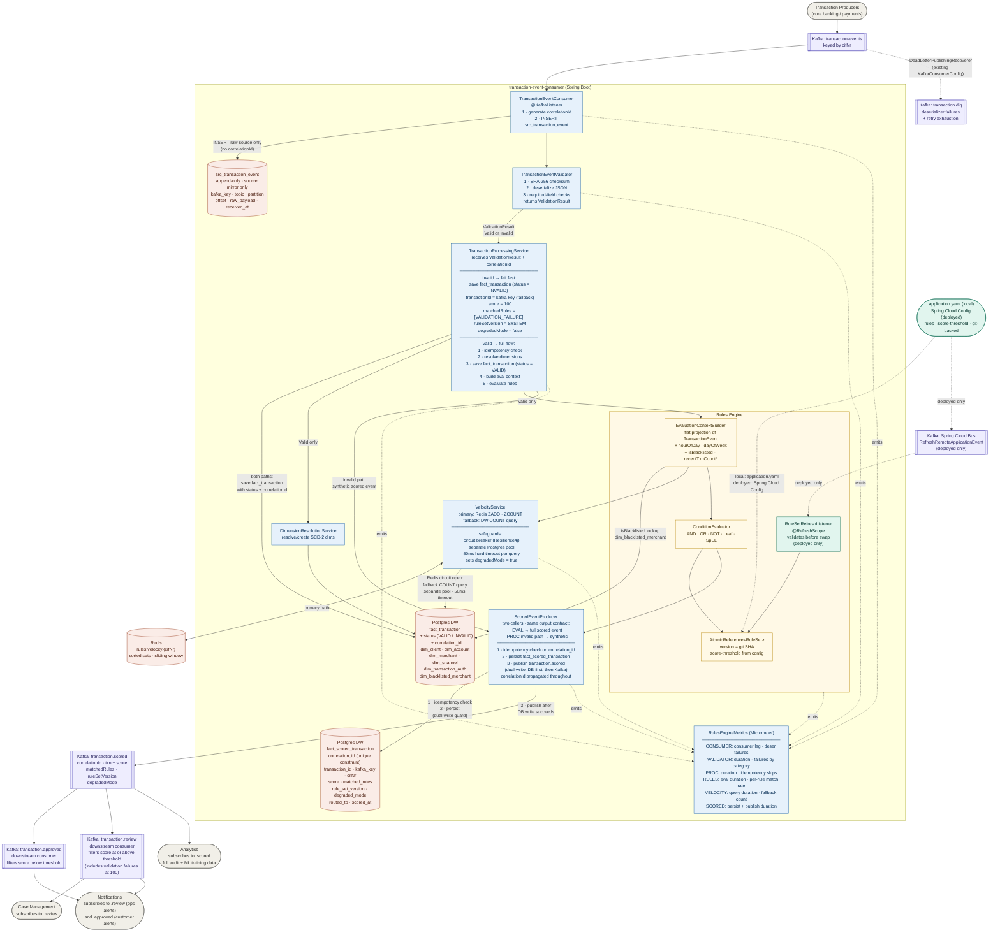

```
███████╗██████╗  █████╗ ██╗   ██╗██████╗ 
██╔════╝██╔══██╗██╔══██╗██║   ██║██╔══██╗
█████╗  ██████╔╝███████║██║   ██║██║  ██║
██╔══╝  ██╔══██╗██╔══██║██║   ██║██║  ██║
██║     ██║  ██║██║  ██║╚██████╔╝██████╔╝
╚═╝     ╚═╝  ╚═╝╚═╝  ╚═╝ ╚═════╝ ╚═════╝

██████╗ ██╗   ██╗██╗     ███████╗███████╗
██╔══██╗██║   ██║██║     ██╔════╝██╔════╝
██████╔╝██║   ██║██║     █████╗  ███████╗
██╔══██╗██║   ██║██║     ██╔══╝  ╚════██║
██║  ██║╚██████╔╝███████╗███████╗███████║
╚═╝  ╚═╝ ╚═════╝ ╚══════╝╚══════╝╚══════╝

███████╗███╗   ██╗ ██████╗ ██╗███╗   ██╗███████╗
██╔════╝████╗  ██║██╔════╝ ██║████╗  ██║██╔════╝
█████╗  ██╔██╗ ██║██║  ███╗██║██╔██╗ ██║█████╗
██╔══╝  ██║╚██╗██║██║   ██║██║██║╚██╗██║██╔══╝
███████╗██║ ╚████║╚██████╔╝██║██║ ╚████║███████╗
╚══════╝╚═╝  ╚═══╝ ╚═════╝ ╚═╝╚═╝  ╚═══╝╚══════╝
```

Hi, I'm Olwethu Ntsukumbini. I'm a Data Engineer for Revenue Management within Capitec Connect. Please check out my [portfolio](https://kendi51.github.io) for a view of who I am and what I enjoy doing. The portfolio is a bit outdated, I built it during Umuzi (Capitec IMI) and does not contain the Software Engineering projects I've worked on at the bank.


Below is a brief description of the project I worked on as a POC for an Software Engineering role.

This is a distributed, event-driven transaction monitoring system built with Spring Boot, Apache Kafka, PostgreSQL, and Redis. The system ingests transaction events, evaluates them against a configurable fraud detection rules engine, assigns risk scores, and routes transactions for approval or manual review.

## Architecture Overview



## Modules

| Module | Description |
|---|---|
| `transaction-producer` | Accepts transaction events via REST and publishes them to Kafka |
| `transaction-event-consumer` | Consumes, validates, scores, and routes transaction events |

## Infrastructure Services

| Service | Port | Purpose |
|---|---|---|
| Kafka Broker 1 | 19092 | Message broker |
| Kafka Broker 2 | 29092 | Message broker |
| Kafka Broker 3 | 39092 | Message broker |
| Kafka UI | 11000 | Broker management UI |
| PostgreSQL 16 | 5432 | Primary database |
| PgAdmin | 5050 | Database management UI |
| Redis | 6379 | Velocity tracking cache |
| RedisInsight | 5540 | Redis management UI |

## Prerequisites

- Java 21
- Maven 3.8+
- Docker and Docker Compose

## Quick Start

### 1. Start infrastructure

```bash
docker-compose up -d
```

Wait for all services to be healthy before starting the applications (approximately 30 seconds).

### 2. Start the producer

```bash
cd transaction-producer
mvn spring-boot:run
```

The producer starts on port `8080`.

### 3. Start the consumer

```bash
cd transaction-event-consumer
mvn spring-boot:run
```

The consumer starts on port `8081`.

### Stopping the applications

Press `Ctrl+C` in each terminal running `mvn spring-boot:run` to stop the producer and consumer.

To stop and remove all infrastructure containers:

```bash
docker-compose down
```

To also remove persisted volumes (database data, Redis data):

```bash
docker-compose down -v
```

## Kafka Topics

| Topic | Producer | Consumer | Description |
|---|---|---|---|
| `transaction-events` | transaction-producer | transaction-event-consumer | Raw inbound events |
| `transaction.scored` | transaction-event-consumer | Downstream | All scored events |
| `transaction.approved` | transaction-event-consumer | Downstream | Score below threshold |
| `transaction.review` | transaction-event-consumer | Downstream | Score at/above threshold |
| `transaction.dlq` | transaction-event-consumer | Ops | Failed/invalid messages |

The default score threshold for routing is **70**.

## Data Flow

1. A transaction event is received by the producer (via REST or scheduled batch).
2. The producer computes a SHA-256 checksum and publishes the event to `transaction-events`.
3. The consumer reads the event, verifies the checksum, and persists a source mirror record.
4. Valid events are enriched with dimension data (client, merchant, channel, auth method).
5. The rules engine evaluates the event using velocity metrics from Redis and fraud detection rules.
6. A risk score is calculated and the scored event is published to `transaction.scored`.
7. Based on the score threshold, the event is also published to `transaction.approved` or `transaction.review`.

## Database Schema

The consumer implements a star-schema data warehouse in PostgreSQL:

- **Source layer** — `src_transaction_event`: raw event mirror with replay guard
- **Fact tables** — `fact_transaction`, `fact_scored_transaction`
- **Dimension tables** — `dim_client`, `dim_account`, `dim_merchant`, `dim_payment_channel`, `dim_transaction_auth`, `dim_blacklisted_merchant` (SCD-2 pattern)

## Monitoring

Both applications expose Prometheus metrics via Spring Boot Actuator.

| Endpoint | URL |
|---|---|
| Producer health | `http://localhost:8080/actuator/health` |
| Producer metrics | `http://localhost:8080/actuator/prometheus` |
| Consumer health | `http://localhost:8081/actuator/health` |
| Consumer metrics | `http://localhost:8081/actuator/prometheus` |
| Kafka UI | `http://localhost:11000` |
| PgAdmin | `http://localhost:5050` |
| RedisInsight | `http://localhost:5540` |

## UI Access

| Tool | URL | Credentials |
|---|---|---|
| pgAdmin | `http://localhost:5050` | Email: `olwethuntsukumbini@capitecbank.co.za` / Password: `password` |
| Kafka UI | `http://localhost:11000` | None (no login required) |
| RedisInsight | `http://localhost:5540` | None (no login required) |

### pgAdmin

1. Open `http://localhost:5050` and log in with the credentials above.
2. Register the database server via **Object → Register → Server**.
3. On the **General** tab set **Name** to any label (e.g. `connect_dev`).
4. Switch to the **Connection** tab and fill in:

| Field | Value |
|---|---|
| Host name/address | `host.docker.internal` (Windows / macOS) |
| Port | `5432` |
| Maintenance database | `postgres` |
| Username | `postgres` |
| Password | `postgres` |

5. Click **Save**. The `connect_dev` database will appear in the browser tree under **Servers**.

> `host.docker.internal` is a Docker-managed shortcut that resolves to the host machine from inside a container on Windows and macOS. On Linux, use `172.17.0.1` (the default Docker bridge gateway) or add `--add-host=host.docker.internal:host-gateway` to the pgAdmin service in `docker-compose.yml`.

### Kafka UI

1. Open `http://localhost:11000` — no login required.
2. The **local** cluster is pre-configured. Select it from the sidebar.
3. Use the **Topics** tab to browse topics, view messages, and inspect consumer lag.
4. Use the **Consumers** tab to monitor the `transaction-event-consumer-group` offset progress.

### RedisInsight

1. Open `http://localhost:5540` — no login required.
2. Click **Add Redis Database**.
3. Fill in:

| Field | Value |
|---|---|
| Host | `host.docker.internal` (Windows / macOS) or `172.17.0.1` (Linux) |
| Port | `6379` |
| Username | `admin` |
| Password | `pass123` |

4. Click **Add Redis Database**. The connection will appear on the home screen.
5. Select the database to browse keys, run commands, and inspect the velocity tracking data stored by the consumer.

## Technology Stack

- **Java 21** / **Spring Boot 3.5.0**
- **Apache Kafka** — event streaming
- **PostgreSQL 16** with pg_partman — persistence and data warehouse
- **Redis** — velocity tracking with circuit breaker fallback to PostgreSQL
- **Flyway** — database migrations
- **Resilience4j** — circuit breaker for Redis
- **Micrometer / Prometheus** — observability
- **Docker Compose** — local infrastructure

## Project Structure

```
SE_Project/
├── transaction-producer/             # Producer microservice
│   ├── src/
│   │   ├── main/
│   │   └── test/
│   ├── Dockerfile
│   ├── pom.xml
│   └── README.md
├── transaction-event-consumer/       # Consumer microservice
│   ├── src/
│   │   ├── main/
│   │   └── test/
│   ├── Dockerfile
│   ├── pom.xml
│   └── README.md
├── postgres/                         # DB init scripts (mounted into the PostgreSQL container)
│   ├── V1_0__create_dbs.sql
│   ├── V1_1__create_schemas.sql
│   ├── V1_2__install_pg_partman.sql
│   ├── V1_3__create_tables.sql
│   └── V1_4__add_stubby_advance_account_fields.sql
├── redis/
│   └── redis.conf                    # Redis server config (auth, persistence settings)
├── architecture.mermaid              # System architecture diagram source
├── docker-compose.yml                # Full stack — all services in one file
├── kafka-cluster.yml                 # Kafka + Zookeeper only
├── postgres.yml                      # PostgreSQL + pgAdmin only
├── redis.yml                         # Redis + RedisInsight only
├── pgadmin.yml                       # pgAdmin only
└── README.md
```

> `target/`, `.idea/`, `.DS_Store`, `.claude/`, and `.claude-flow/` are excluded via `.gitignore` and do not appear above.
